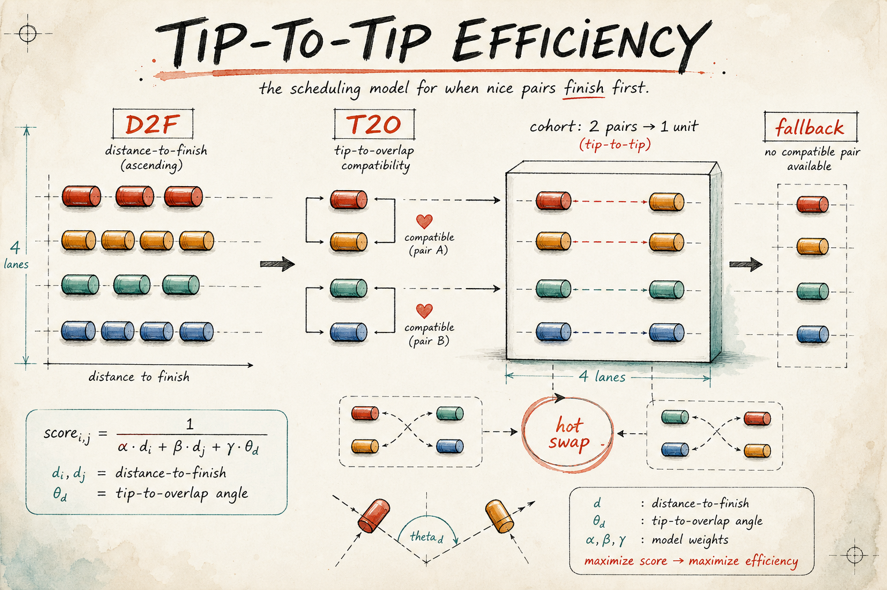

# tip-to-tip-efficiency



A focused Rust implementation of the *Silicon Valley* tip-to-tip efficiency
thought experiment.

This crate is intentionally narrow. It models the joke as a deterministic
scheduling problem:

- Dinesh's closed form: `participants * mean_time / lanes`
- four-at-a-time "middle-out" ideal
- D2F sorting
- adjacent D2F pairing
- bridge feasibility from combined length
- `theta_d = asin(d2f_gap / bridge)`
- girth and T2O compatibility
- optional hot swapping
- fallback lanes for incompatible or odd profiles
- idle-time and throughput accounting
- enterprise portfolio reports across many rooms

It is not a compression crate. It is not a physics simulator. It is a clean API
for the bit: comedy premise, engineering discipline.

## Example

```rust
use tip_to_tip::{D2fProfile, TipToTip, TipToTipConfig};

let profiles = [
    D2fProfile::new(1, 10.0, 2.0, 4.0, 10.0),
    D2fProfile::new(2, 11.0, 2.0, 4.0, 10.0),
    D2fProfile::new(3, 12.0, 2.0, 4.0, 10.0),
    D2fProfile::new(4, 13.0, 2.0, 4.0, 10.0),
];

let plan = TipToTip::plan(&profiles, TipToTipConfig::default())?;

assert_eq!(plan.total_seconds, 10.0);
assert_eq!(plan.two_lane_baseline_seconds, 20.0);
assert_eq!(plan.throughput_gain_over_two_lane, 2.0);
# Ok::<(), tip_to_tip::TipToTipError>(())
```

## API Shape

Use `TipToTip::dinesh_closed_form` for the simple room estimate:

```rust
use tip_to_tip::TipToTip;

assert_eq!(TipToTip::dinesh_closed_form(800, 10.0, 2)?, 4000.0);
assert_eq!(TipToTip::ideal_middle_out_seconds(800, 10.0)?, 2000.0);
# Ok::<(), tip_to_tip::TipToTipError>(())
```

Use `TipToTip::plan` when you have per-participant D2F profiles and want a full
schedule with pairs, cohorts, unmatched fallback work, and waste accounting.

Use `TipToTipEmpire::audit` when the bit has escaped the garage and become
enterprise governance.

```rust
use tip_to_tip::{
    D2fProfile, TipToTipConfig, TipToTipEmpire, TipToTipEmpirePolicy, TipToTipRoom,
};

let room = TipToTipRoom::new(
    "hacker-hostel",
    [
        D2fProfile::new(1, 10.0, 2.0, 4.0, 10.0),
        D2fProfile::new(2, 11.0, 2.0, 4.0, 10.0),
        D2fProfile::new(3, 12.0, 2.0, 4.0, 10.0),
        D2fProfile::new(4, 13.0, 2.0, 4.0, 10.0),
    ],
    TipToTipConfig::default(),
);

let report = TipToTipEmpire::audit(&[room], TipToTipEmpirePolicy::default())?;

assert_eq!(report.promoted_rooms, 1);
# Ok::<(), tip_to_tip::TipToTipError>(())
```

## Architecture

The crate is split so `TipToTip` stays as the small public ingress point:

- `tip_to_tip.rs`: facade methods for core room math
- `planner.rs`: D2F sorting, pairing, cohort scheduling, fallback lanes, and metrics
- `enterprise.rs`: multi-room audit reports, policy signals, and portfolio rollups
- `acceleration.rs`: CPU/GPU routing advice for load-scale workloads
- `profile.rs`, `config.rs`, `plan.rs`: public data model
- `validation.rs`, `error.rs`, `constants.rs`: shared guardrails

That separation keeps the joke readable while letting the planner and enterprise
layers carry the serious invariants.

## Testing

```sh
cargo test
cargo clippy --all-targets
cargo bench
scripts/profile-cpu.sh
cargo run --example gpu_readiness
```

Mutation testing is supported when `cargo-mutants` is installed:

```sh
scripts/mutation-test.sh
```

The current focused mutation target is the tip-to-tip model. Surviving mutants
are treated as test failures across the facade, planner, validation, and
enterprise layers.

## Benchmarks And Chaos

Criterion benchmarks live in `benches/tip_to_tip.rs` and cover both the
room-level planner and enterprise audit rollups. They are intended to provide
stable comparison points for:

- planning 16, 64, 256, and 1024 profiles
- fallback storms with 1024, 4096, and 16384 incompatible profiles
- auditing 4x64, 16x64, and 32x128 room portfolios

Chaos tests live in `tests/chaos.rs`. They use fixed seeds so failures reproduce
cleanly while still exercising noisy rooms, mixed compatibility, fallback lanes,
hot swapping, portfolio rollups, and invalid numeric storms.

The runtime surface is CPU-only and in-memory. There is no OSI-layer I/O path:
no sockets, HTTP client/server, async runtime, filesystem, or subprocess work in
`src/`. `scripts/profile-cpu.sh` attempts `perf stat -d` for hardware counters
and falls back to Criterion when kernel perf events are unavailable.

## GPU Acceleration

The crate exposes `TipToTipAcceleration` as a hardware-neutral advisor:

```rust
use tip_to_tip::{ComputeBackend, TipToTipAcceleration};

let report = TipToTipAcceleration::assess_counts(128, 1_000_000, 4_096);

assert_eq!(report.backend, ComputeBackend::GpuCandidate);
```

Normal rooms stay on CPU because the planner is dominated by deterministic sort,
branchy compatibility checks, and small vector construction. A GPU starts to make
sense only for very large batched portfolios where pair screening and reductions
can amortize data transfer and kernel launch overhead. The current crate does
not ship a CUDA/WebGPU kernel; the advisor defines the boundary where adding one
would be technically justified.
